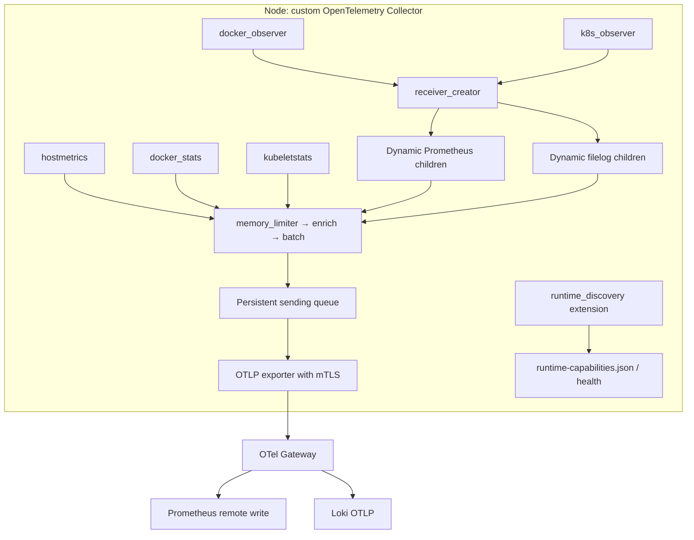
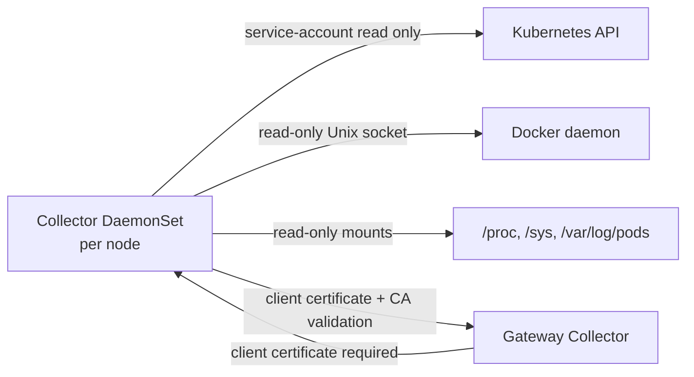
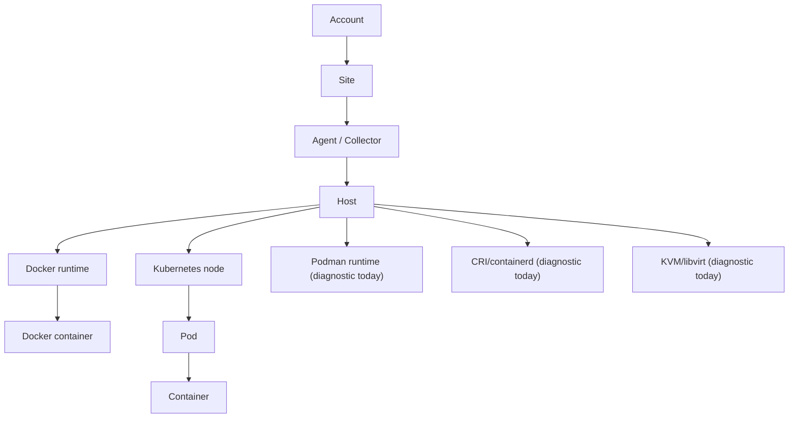
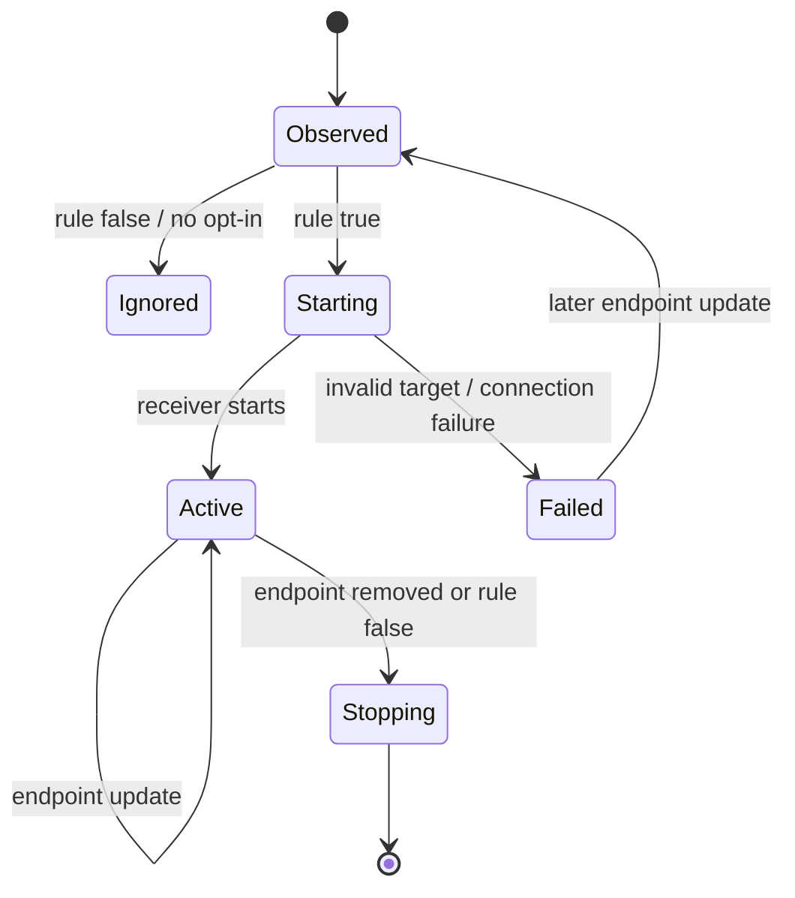
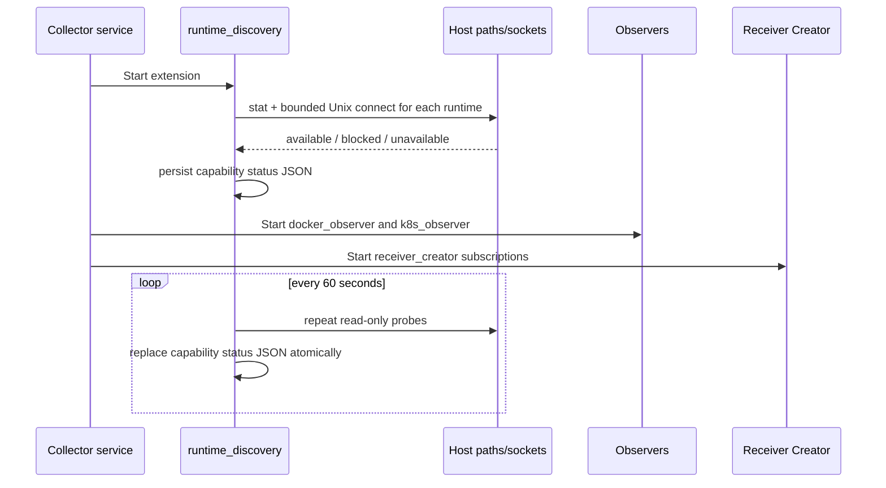
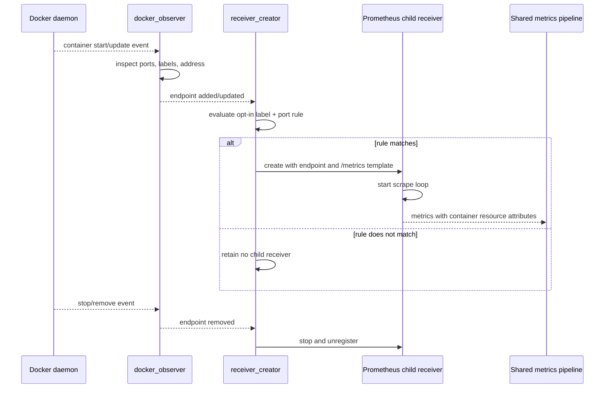
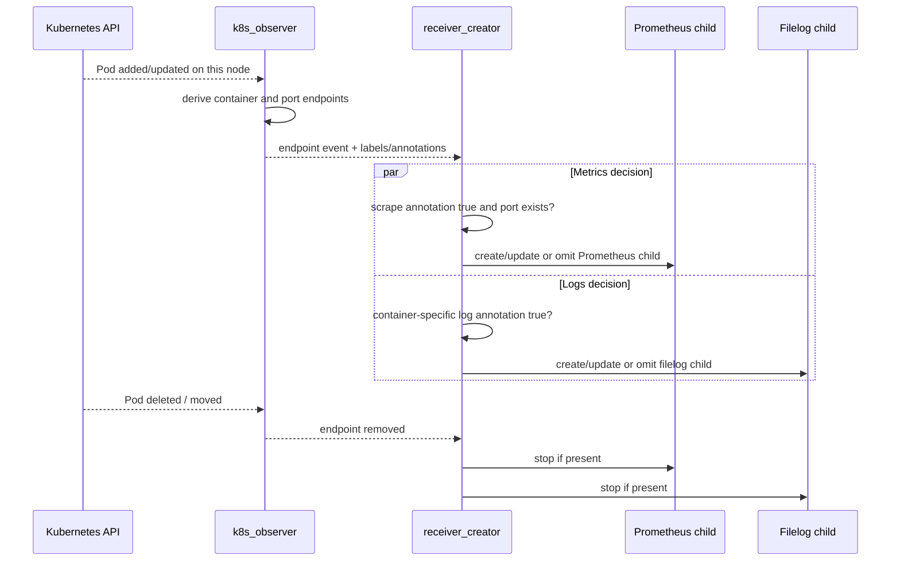
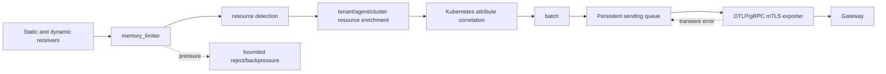

# Intelligent Observability Node Agent — HLD and LLD

## 1. Purpose and implementation boundary

The node agent is a custom **OpenTelemetry Collector Contrib distribution** deployed once per node as a Kubernetes DaemonSet. It discovers local workloads, activates workload-specific receivers without restarting the Collector, collects node/runtime telemetry, normalizes and enriches it, buffers it locally, and exports it to the OpenTelemetry Gateway using mutual TLS.

There is no separate agent daemon, no custom telemetry protocol, and no component that changes Docker, Kubernetes, or hypervisor state.

```text
Node Collector -> OTLP/gRPC + mTLS -> Gateway Collector -> Prometheus remote-write / Loki OTLP -> Grafana
```

### Current implementation

| Capability | Implementation | Lifecycle |
|---|---|---|
| Host metrics | `hostmetrics` | Long-lived node receiver |
| Docker resource metrics | `docker_stats` | Long-lived node receiver; one Docker daemon |
| Kubernetes node/pod/container metrics | `kubeletstats` | Long-lived node receiver |
| Kubernetes container logs | `receiver_creator/logs` + `filelog` child | Opt-in dynamic child per annotated container |
| Docker application endpoint discovery | `docker_observer` | Docker event stream |
| Kubernetes workload discovery | `k8s_observer` | Kubernetes API watch, limited to the local node |
| Dynamic Prometheus scrape receivers | `receiver_creator/prometheus` | Created/removed per matching endpoint |
| Dynamic Kubernetes log receivers | `receiver_creator/logs` | Created/removed per annotated container |
| Runtime capability diagnostics | custom `runtime_discovery` extension | Startup + 60-second probe cycle |
| mTLS, queue, retry and backpressure | OTLP exporter, `file_storage`, processors | Shared pipeline |

Podman, containerd/CRI-O, and KVM/libvirt are **detected and reported** by `runtime_discovery`; specialized collectors for their resource metrics are not yet included in this distribution. They require supported upstream receiver components or purpose-built Collector receivers before they can be activated.

### Metrics and telemetry inventory by service

Metric names can vary slightly with the pinned Collector Contrib version. The table below describes the metric families enabled by the current configuration; it does not promise every optional metric emitted by a receiver.

| Service / target | Collector component | Metrics or telemetry collected | Notes |
|---|---|---|---|
| Physical host | `hostmetrics` | CPU time/utilization, load, memory and swap usage, disk bytes/operations, filesystem capacity and inode usage, network bytes/packets/errors/drops, paging, and process counts | Read from the host via `/hostfs`; collected every 15 seconds |
| Docker daemon and containers | `docker_stats` | Per-container CPU, memory, network, block I/O, container state, and runtime metadata | One node-level receiver querying the Docker socket every 15 seconds |
| Kubernetes node | `kubeletstats` | Node CPU, memory, filesystem, network, and volume usage/capacity | Kubelet endpoint; collected every 15 seconds |
| Kubernetes Pod | `kubeletstats` | Pod CPU, memory, filesystem, network, and volume usage/capacity | Resource-enriched with node/Pod identity |
| Kubernetes container | `kubeletstats` | Container CPU, memory, filesystem, network, restart/state-related kubelet statistics, and container ID metadata | Includes all network interfaces for node and Pod where available |
| Docker application endpoint | Dynamic Prometheus child | Any metrics exposed by an opted-in container's `/metrics` endpoint: for example HTTP request counts/duration, process/runtime metrics, queue depth, cache/database metrics | Created only when a container has a published port and `observability.opentelemetry.io/scrape=true` label |
| Kubernetes application endpoint | Dynamic Prometheus child | Any metrics exposed by an opted-in Pod container's `/metrics` endpoint | Created only when the Pod has `observability.opentelemetry.io/scrape: "true"` and a declared container port |
| Kubernetes annotated container | Dynamic `filelog` child | Logs, not metrics: timestamp, severity, body, Kubernetes/container correlation attributes | Created only with `io.opentelemetry.discovery.logs.<container>/enabled: "true"` |
| Runtime capabilities: host, Docker, Podman, containerd, CRI-O, Kubernetes, KVM/libvirt | `runtime_discovery` extension | Diagnostic capability state (`available`, `blocked`, `unavailable`) and endpoint/reason data in local status JSON | This is health/diagnostic data, not an OTLP metrics receiver |
| Podman, containerd/CRI-O, KVM/libvirt | Capability probe only | No resource metrics are collected yet | The status file makes this gap visible without failing other collection |

For dynamically scraped Prometheus targets, the application owns the metric names and cardinality. The agent adds trusted host/tenant/workload resource attributes but does not convert arbitrary application labels into new platform labels.

## 2. High-level architecture



## 3. Deployment and trust model

One Collector pod runs on each node with `hostNetwork` and read-only mounts for the host filesystem, pod logs, Docker socket path, and a local persistent queue directory. It runs as root only because the Docker socket and host pseudo-filesystems commonly require it; Linux capabilities are dropped, privilege escalation is disabled, the root filesystem is read-only, and seccomp uses the runtime default profile.

The service account has only `get`, `list`, and `watch` permissions for Pods and Nodes plus kubelet statistics access. It cannot create, update, delete, exec, or mutate workload resources.



## 4. Resource hierarchy and normalization

The pipeline attaches identity once, at the Collector. Runtime-provided labels and annotations can select collection, but cannot overwrite tenant identity.



| Layer | Trusted attributes |
|---|---|
| Account/site | `account.id`, `site.id` |
| Agent/host | `agent.id`, `host.name`, `host.id`, `os.type`, `host.arch` |
| Cluster | `k8s.cluster.name`, `k8s.node.name` |
| Kubernetes workload | `k8s.namespace.name`, `k8s.pod.name`, `k8s.pod.uid`, `k8s.container.name`, `container.id`, `container.image.name` |
| Docker workload | `container.id`, `container.name`, `container.image.name` |
| Runtime diagnostic | `runtime.name`, `runtime.state`, `runtime.endpoint` (health output only) |

Cardinality policy: IDs are resource attributes, never metric labels in an aggregated metric. Container names/images are allowed only on workload-level metrics. Arbitrary Docker labels, environment variables, command lines, mounts, tokens, and Kubernetes annotations are not exported as telemetry attributes.

## 5. Component low-level design

### 5.1 `runtime_discovery` capability adapter

This custom Collector extension performs read-only capability checks at startup and every 60 seconds. It records a JSON status document at `/var/lib/otelcol/runtime-capabilities.json`; it does not itself create a pipeline or restart the Collector.

| Adapter | Probe | States | Result |
|---|---|---|---|
| Host | `/hostfs/proc/stat` | available/unavailable | Confirms host collection context |
| Docker | `/hostfs/var/run/docker.sock` + Unix connect | available/blocked/unavailable | Diagnostic for `docker_stats` and `docker_observer` |
| Podman | rootful/rootless Podman sockets + Unix connect | available/blocked/unavailable | Diagnostic; no stats receiver yet |
| containerd | `/hostfs/run/containerd/containerd.sock` + Unix connect | available/blocked/unavailable | Diagnostic; no CRI receiver yet |
| CRI-O | `/hostfs/run/crio/crio.sock` + Unix connect | available/blocked/unavailable | Diagnostic; no CRI receiver yet |
| Kubernetes | `/hostfs/var/lib/kubelet` | available/unavailable | Diagnostic for kubelet context |
| KVM/libvirt | libvirt socket or `/hostfs/dev/kvm` | available/unavailable | Diagnostic; no libvirt receiver yet |

`blocked` means a path/socket exists but cannot be accessed. `unavailable` means it is absent. A failed check is isolated to that adapter and never stops host or Kubernetes collection.

### 5.2 Runtime observers

Observers are event producers. They do not scrape telemetry.

| Observer | Source | Event types | Endpoint metadata |
|---|---|---|---|
| `docker_observer` | Docker API event stream | add, update, remove | container ID, image, name, labels, address, exposed/bound port |
| `k8s_observer` | Kubernetes API Pod watch | add, update, remove | namespace, Pod UID/name, container ID/image/name, port, annotations |

The Kubernetes observer is configured with `node: ${env:K8S_NODE_NAME}`, so it reports only Pods scheduled on the same node as the agent. The Docker observer uses host bindings so a host-network Collector can reach an opted-in published endpoint.

### 5.3 Receiver Creator: adapter activation controller

`receiver_creator` subscribes to observer events and evaluates rules. A rule match causes it to construct a child receiver from a safe, pre-defined template. On endpoint removal or a rule mismatch, it shuts down only that child receiver and releases its resources.



Activation rules in `deploy/otel/agent-config.yaml`:

| Workload | Eligibility | Child receiver | Stop condition |
|---|---|---|---|
| Docker metrics endpoint | Exposed port and Docker label `observability.opentelemetry.io/scrape=true` | Prometheus receiver scraping `/metrics` | Container stops, port/label removed |
| Kubernetes metrics endpoint | Declared container port and Pod annotation `observability.opentelemetry.io/scrape=true` | Prometheus receiver scraping `/metrics` | Pod/container/port removed or annotation changes |
| Kubernetes container logs | `io.opentelemetry.discovery.logs.<container>/enabled=true` | Filelog receiver with container parser | Container removed or annotation changes |

Rules are deliberately opt-in. A discovered endpoint never becomes a scrape target merely because it exposes a port.

## 6. Discovery and activation sequence diagrams

### 6.1 Collector startup and capability diagnostics



### 6.2 Docker container → dynamic Prometheus receiver



### 6.3 Kubernetes Pod → dynamic log/metrics receivers



## 7. Unified telemetry pipeline



1. Receivers convert host/runtime/application input into OTLP metrics or logs.
2. `memory_limiter` enforces the process memory boundary before batching.
3. Resource processors attach account, site, agent, host, and cluster identity from trusted configuration/environment.
4. `k8sattributes` correlates workload telemetry with Kubernetes metadata.
5. `batch` groups telemetry for export efficiency.
6. The exporter persists queued batches using `file_storage`, retries with exponential backoff, and sends over TLS with a CA, client certificate, and private key.

The queue is bounded (`queue_size: 10000`). During a sustained outage the Collector applies backpressure rather than consuming unlimited memory or disk. Certificate files are reloaded periodically to support rotation.

## 8. Failure isolation and operational diagnostics

| Failure | Scope | Behavior | Operator signal |
|---|---|---|---|
| Docker socket absent or denied | Docker stats/observer | Other receivers continue; capability becomes unavailable/blocked | capability JSON + Collector logs/metrics |
| One dynamic target unreachable | One child receiver | That child reports errors/retries; all other children continue | child receiver errors |
| Kubernetes API watch unavailable | K8s observer/dynamic children | Existing static host/Docker collection continues; observer reconnects | observer error/health |
| Kubelet unavailable | `kubeletstats` | Host/Docker/dynamic workloads continue | receiver errors |
| Gateway or network outage | Export path | Persistent queue and retry apply | queue growth/exporter failures |
| Bad workload annotation | One child configuration | Receiver Creator rejects that child; Collector service stays up | Receiver Creator error |

Health is exposed through `health_check` on port `13133`. The capability file is deliberately local and contains operational state, not credentials or arbitrary runtime metadata. The Collector's own metrics/logs should be scraped separately and not recursively through this agent.

## 9. Configuration contract

The authoritative configuration is [agent-config.yaml](../deploy/otel/agent-config.yaml). Environment values are injected by the DaemonSet:

| Variable | Meaning |
|---|---|
| `ACCOUNT_ID`, `SITE_ID` | Tenant scope assigned at deployment/enrollment |
| `AGENT_ID` | Node identity (currently node name) |
| `K8S_CLUSTER_NAME` | Stable cluster identity |
| `K8S_NODE_NAME` | Downward-API node name; scopes observer discovery |
| `MY_POD_IP` | Health endpoint bind address |
| `OTEL_GATEWAY_ENDPOINT` | Gateway OTLP/gRPC endpoint |

Secrets are mounted at `/etc/otel/tls`; they are never supplied through labels, annotations, or workload-visible environment variables.

## 10. Build and deployment layout

```text
Dockerfile                                      Builds the custom Collector image
collector-builder.yaml                          Registers Collector components
custom-components/runtime-discoveryextension/   Capability diagnostic extension
deploy/otel/agent-config.yaml                   Node Collector receivers/pipelines/rules
deploy/otel/gateway-config.yaml                 Gateway Collector pipeline
deploy/otel/kubernetes.yaml                     RBAC, DaemonSet, Service, Gateway Deployment
docs/DEPLOYMENT.md                               Deployment commands and opt-in annotations
```

Build with the OpenTelemetry Collector Builder, publish the resulting image, create the ConfigMaps/TLS Secrets, then apply the DaemonSet manifest. The Builder configuration pins component versions; validate a built image against the same pinned version before production rollout.

## 11. Extension roadmap

The architecture supports new adapters without creating a second agent process. Each runtime needs: a read-only capability probe, a Collector receiver capable of gathering its telemetry, resource mapping, cardinality tests, and failure-isolation tests.

| Runtime | Next Collector implementation step |
|---|---|
| Podman | Add/author a Podman Collector receiver, then make its activation capability-aware |
| containerd / CRI-O | Add/author a CRI receiver that queries the socket with read-only RPCs |
| KVM/libvirt | Add/author a libvirt read-only receiver |
| Non-container services | Add receiver templates with explicit labels/annotations and `receiver_creator` rules |

No future adapter may execute commands, alter runtime resources, or accept arbitrary receiver configuration from workload metadata. Templates and allowlisted dynamic values remain controlled by the platform configuration.
